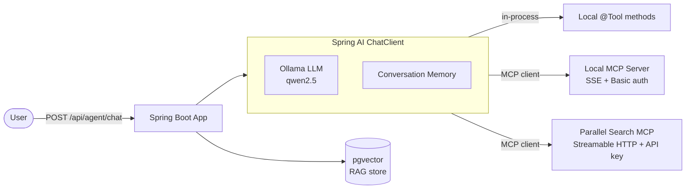
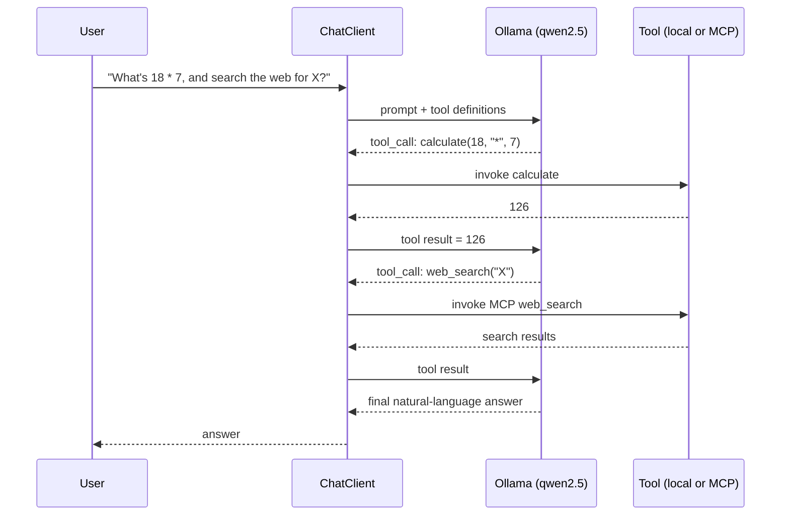
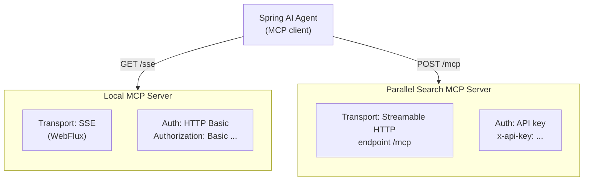
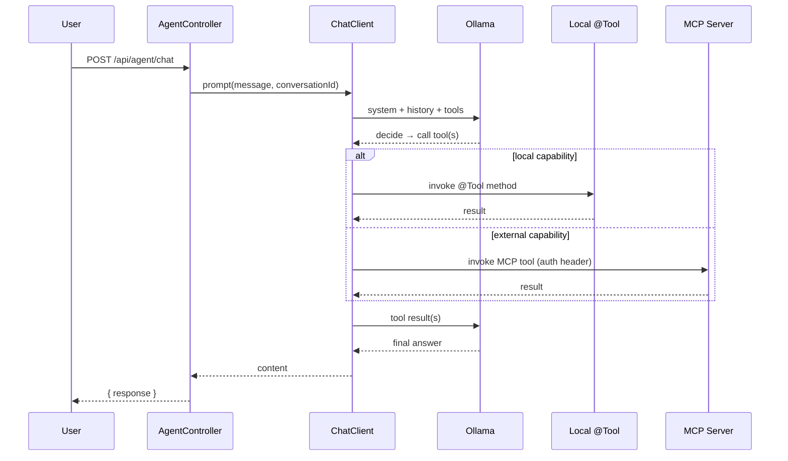
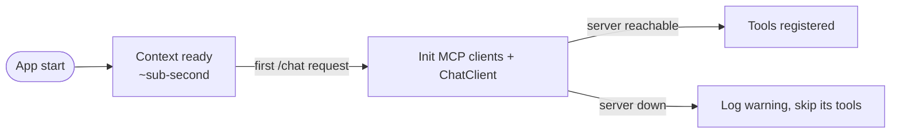

# Building an Autonomous Agent with Spring AI, Ollama, and MCP Tool Calling

A practical, architecture-first walkthrough of how this project turns a local
LLM into an autonomous agent that can call **local tools** and **remote MCP
tools** — each over its own protocol and authentication scheme — while using
**pgvector** for retrieval-augmented answers.

---

## Table of Contents
1. [The big picture](#1-the-big-picture)
2. [Spring AI: the glue](#2-spring-ai-the-glue)
3. [Ollama: the local model](#3-ollama-the-local-model)
4. [Tool calling, explained](#4-tool-calling-explained)
5. [Local tools (`@Tool`)](#5-local-tools-tool)
6. [MCP tools: protocols & authentication](#6-mcp-tools-protocols--authentication)
7. [How a request flows end to end](#7-how-a-request-flows-end-to-end)
8. [Lazy startup: failing soft when a tool server is down](#8-lazy-startup-failing-soft-when-a-tool-server-is-down)
9. [Takeaways](#9-takeaways)

---

## 1. The big picture

The service is a Spring Boot app that hosts an **agent**. The agent reasons
with a local LLM and, when it helps, calls tools to get real facts or perform
actions. Tools come from two places:

- **Local tools** — plain Java methods annotated with `@Tool`, running in-process.
- **MCP tools** — provided by external **MCP servers** the agent connects to as a client.



**Stack at a glance**

| Concern        | Choice                                             |
|----------------|----------------------------------------------------|
| Language/build | Java 21+, Gradle                                   |
| Framework      | Spring Boot 3.5.x, Spring AI 1.1.x                 |
| Model runtime  | Ollama (local)                                     |
| Chat model     | `qwen2.5:7b`                                        |
| Embeddings     | `nomic-embed-text` (768-dim)                        |
| Vector store   | pgvector (Postgres)                                |
| Remote tools   | Two MCP servers, each with its own auth            |

---

## 2. Spring AI: the glue

Spring AI provides a single abstraction — the **`ChatClient`** — that ties the
model, the tools, memory, and cross-cutting advisors together. You describe
*what* the agent has access to; Spring AI handles the tool-calling loop with
the model.

The `ChatClient` is assembled once as a bean:

```java
return builder
    .defaultSystem(SYSTEM_PROMPT)
    // local @Tool beans
    .defaultTools(agentTools, documentationTools)
    // tools discovered from every reachable MCP server
    .defaultToolCallbacks(mcpToolProvider.getToolCallbacks())
    .defaultAdvisors(
        MessageChatMemoryAdvisor.builder(chatMemory).build(),
        new SimpleLoggerAdvisor())
    .build();
```

Two things matter here:

- **`defaultTools(...)`** registers local Java methods as callable tools.
- **`defaultToolCallbacks(...)`** registers remote MCP tools, aggregated from
  all connected MCP servers.

To the model, both look the same: a named tool with a description and a schema.

---

## 3. Ollama: the local model

The agent runs entirely on a **local** model through Ollama — no external LLM
API. That keeps data on your machine and removes per-token cost.

Two models are used:

- **Chat** (`qwen2.5:7b`) — reasons and decides which tools to call.
- **Embeddings** (`nomic-embed-text`) — turns text into 768-dim vectors for RAG.

```yaml
spring:
  ai:
    ollama:
      base-url: http://localhost:11434
      chat:
        options:
          model: qwen2.5:7b
          temperature: 0.2
      embedding:
        options:
          model: nomic-embed-text
```

The chat model must support **tool calling** for the agent loop to work —
`qwen2.5` does.

---

## 4. Tool calling, explained

Tool calling is how an LLM goes from "predicting text" to "taking action."
Instead of guessing a fact it can't know, the model emits a structured request
to call a named tool. The framework runs the tool and feeds the result back,
and the loop repeats until the model produces a final answer.



The key insight: **the model never runs code**. It only *asks* for a tool by
name. Spring AI validates the call, executes it, and returns the result. This
is true for both local and MCP tools.

---

## 5. Local tools (`@Tool`)

Local tools are ordinary Spring beans whose methods are annotated with
`@Tool`. The annotation's description is what the model sees, so it should read
like an instruction.

```java
@Component
public class AgentTools {

    @Tool(description = "Evaluate a simple arithmetic expression with two numbers. "
            + "Supported operators: +, -, *, /")
    public double calculate(double left, String operator, double right) {
        return switch (operator) {
            case "+" -> left + right;
            case "-" -> left - right;
            case "*" -> left * right;
            case "/" -> {
                if (right == 0) throw new IllegalArgumentException("Division by zero");
                yield left / right;
            }
            default -> throw new IllegalArgumentException("Unknown operator: " + operator);
        };
    }
}
```

Adding a new local capability is just: **write a method, annotate it, done.**
No transport, no serialization, no auth — it runs in-process.

This project ships two local tool beans:

- **`AgentTools`** — current date/time, arithmetic, system info.
- **`DocumentationTools`** — scan the repo for missing Javadoc, read a file,
  write a file (path-confined to the repo root, `.java` only).

---

## 6. MCP tools: protocols & authentication

The **Model Context Protocol (MCP)** is an open standard that lets an agent
consume tools hosted by an external server. The agent is the **MCP client**;
each tool provider is an **MCP server**. This is what makes tools *pluggable* —
you can add capabilities without redeploying the agent.

### Why the clients are wired by hand

Spring AI can auto-configure MCP clients, but auto-config shares **one**
WebClient across all connections — it can't carry **per-server credentials**.
This project has two servers with **different transports and different auth**,
so auto-config is disabled and each client is built manually.

```yaml
spring:
  ai:
    mcp:
      client:
        enabled: false   # built by hand instead — see below
```

### The two servers side by side



| Server            | Transport                          | Auth mechanism | Header                      |
|-------------------|------------------------------------|----------------|-----------------------------|
| `local`           | SSE (`WebFluxSseClientTransport`)  | HTTP Basic     | `Authorization: Basic ...`  |
| `parallel-search` | Streamable HTTP                    | API key        | `x-api-key: ...`            |

### Local server — SSE + HTTP Basic

Server-Sent Events keeps a long-lived stream open; the agent authenticates
with an encoded Basic credential on the `Authorization` header.

```java
String basicToken = HttpHeaders.encodeBasicAuth(username, password, UTF_8);
WebClient.Builder web = WebClient.builder()
        .baseUrl(url)
        .defaultHeader(HttpHeaders.AUTHORIZATION, "Basic " + basicToken);

var transport = WebFluxSseClientTransport.builder(web)
        .sseEndpoint(sseEndpoint)   // e.g. /sse
        .build();
```

### Parallel search — Streamable HTTP + API key

Streamable HTTP posts to a single `/mcp` endpoint; the agent authenticates with
a secret API key on a custom header, read from an environment variable.

```java
WebClient.Builder web = WebClient.builder()
        .baseUrl(url)
        .defaultHeader("x-api-key", apiKey);   // from ${PARALLEL_API_KEY}

var transport = WebClientStreamableHttpTransport.builder(web)
        .endpoint(endpoint)   // /mcp
        .build();
```

### Aggregating every server's tools

Each reachable MCP client contributes its tools to **one** provider, which the
`ChatClient` exposes to the model alongside the local tools:

```java
@Bean
ToolCallbackProvider mcpToolProvider(List<McpSyncClient> mcpSyncClients) {
    return new SyncMcpToolCallbackProvider(mcpSyncClients);
}
```

**Adding a new MCP server** is a one-bean change: define another
`McpSyncClient` with its own transport and auth, and it's auto-aggregated into
the provider — no other wiring needed.

---

## 7. How a request flows end to end



The controller stays thin: it validates input and delegates. All orchestration
lives in the `ChatClient` configuration.

---

## 8. Lazy startup: failing soft when a tool server is down

MCP servers are external and can be offline. If the agent tried to connect to
every server during startup, a single unreachable server would delay or block
boot.

The fix is **lazy initialization**: the MCP clients and the dependent
`ChatClient` are created on **first use**, not at boot. The app starts fast,
and an unavailable server is simply skipped — the agent degrades to the tools
it *can* reach.



Two layers cooperate:

- **`spring.main.lazy-initialization: true`** defers bean creation until needed.
- A **guarded initializer** catches connection failures, closes the dead
  client, and returns `null` so it's excluded from the aggregated tool list:

```java
McpSyncClient safeInitialize(String name, McpSyncClient client) {
    try {
        client.initialize();
        return client;
    } catch (Exception e) {
        log.warn("MCP server '{}' unavailable, skipping its tools: {}", name, e.getMessage());
        try { client.close(); } catch (Exception ignore) { }
        return null;
    }
}
```

**Result:** startup no longer depends on every downstream tool server being
alive.

---

## 9. Takeaways

- **Spring AI's `ChatClient`** unifies model, tools, memory, and advisors
  behind one API.
- **Ollama** keeps the model — chat and embeddings — fully local.
- **Tool calling** lets the model act via named tools; it never runs code
  itself.
- **Local tools** are trivial: a `@Tool`-annotated method.
- **MCP tools** are pluggable and can each use a **different protocol**
  (SSE vs. Streamable HTTP) and **different auth** (Basic vs. API key) — which
  is exactly why the clients are built by hand.
- **Design integrations to fail soft.** Lazy init + guarded connections mean a
  dead tool server can't stop the agent from starting.
